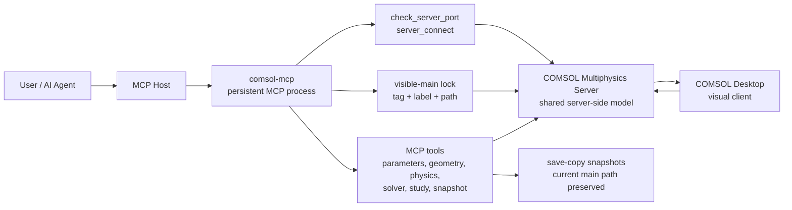

# COMSOL MCP

中文 | [English](#english)

`comsol-mcp` 是一个面向 COMSOL Multiphysics 的 MCP Server。它采用
**attach-first** 工作流：先连接到一个已经运行的 COMSOL Multiphysics Server，
再加载并锁定一个主 `.mph` 模型，让 MCP 和 COMSOL Desktop 看到并操作同一个
服务端模型。

这个项目的目标不是把 COMSOL 当成黑盒批处理器，而是让自动化过程保持可见：
你可以在 Desktop 中实时观察 MCP 对几何、参数、网格、求解和保存流程的修改。

## 当前实现状态（2026-09-23，G3.5 验收完成）

> 本节反映 G3.5（Gate A: G01–G12 缺陷定向修补与 W19: 作业目录、排队取消、恢复与并发控制 J01–J10）的实机 live 验收状态。
> 权威验收判定为 **PASS**，状态标识为 `G3_5_MAC_W19_VERIFIED_SCOPED`，严格停止于 W19，未进入 W20–W26。

- **MCP 工具与接口面**：
  - 工具数量由运行时动态发现生成：当前发布 **70 个 MCP 工具** 与 **126 个领域 operations**（包含绘图、导出、作业控制 `job_*` 等）。
  - 支持完整的 MCP `ImageContent(type="image", data=b64, mimeType="image/png")` 多模态图形返回与 TextContent 防膨胀摘要分离。
- **Gate A (G01–G12) 关键缺陷修复**：
  - **G01**: 源码恢复自公开锁定提交，实现环境 site-packages、源码、项目数据根、工作目录 cwd 的严格四路径隔离。
  - **G02**: 统一新产物发布与覆盖保护，移除 staging 缺失即沿用旧图的逻辑，`allow_overwrite` 强制显式布尔授权。
  - **G03**: 属性恢复在 finally 块中单调升级并记录至 `_ModelState.dirty`，防止基于脏模型继续写入。
  - **G04**: 产物路径严格收敛于项目根，支持原子安全发布与覆盖保护。
  - **G05**: 区分数据集引用与实际求解解（solution），不存在解 fail-closed，瞬态多时刻独立渲染。
  - **G06**: 2D 矩阵保持原生嵌套结构，支持 3 级路径穿透访问，深度 > 3 写前拒绝。
  - **G07**: 完整 PNG 结构解析与坏块拒绝，失败信封无图且保留执行元数据。
  - **G08**: 真实 `storage=artifact` wire 预算截断与完整数据分离，malformed envelope 作为负控。
  - **G09**: 7,219 项文件全量 SHA-256 审计对比与单文件改动负控。
  - **G10**: `plot.render` / `plot_render` / `operation_call` 三入口完全等价。
  - **G11**: 保护外部已有 mphserver PID，禁止任何未经授权的跨进程干扰。
  - **G12**: 模型存盘重开并恢复渲染，交付回执闭环。
- **W19 (J01–J10) 作业控制、取消、恢复与并发能力**：
  - **J01**: 作业目录分页、状态过滤与租户隔离，建立 SQLite 索引。
  - **J02**: 排队作业原子取消，无引擎派发，单调终态。
  - **J03**: 运行中取消如实报告 `UNSUPPORTED_NATIVE_CANCEL`，严格防止未授权强制终止。
  - **J04**: 宿主断连与幂等恢复，相同请求直接恢复，冲突安全拒绝。
  - **J05**: 控制进程重启协调，未决作业进入 `RECONCILING`。
  - **J06**: 控制读取脱离串行引擎队列，实测 p95 < 1.0s 子秒响应。
  - **J07**: 单 COMSOL 实例引擎请求严格串行化。
  - **J08**: RPC 等待超时与排队期限独立策略。
  - **J09**: SQLite WAL 模式、持久化索引与进程安全。
  - **J10**: 求解 -> 测温 -> 渲染 -> 网关回传全链路通过。
- **实机验收与交付状态**：
  - 实机 live 验收套件（`tests/run_g3_5_acceptance.py`，G01–G12 与 J01–J10 共 22 项用例）**22/22 全部 PASS**（用时 15.31s，exit 0）。
  - 控制平面单元测试全量 PASS。
  - 独立离线交付包（`COMSOL_MCP_G3_5_DELIVERABLE.tar.gz`）包含全量独立 Git Bundle（`comsol_mcp_g3_5.bundle`，支持 standalone clone），未执行外部 `git push`。
  - 云端 Hermes 视觉接收继续保持 `HOST_DELIVERY_UNVERIFIED`。

## 主要特性

- 连接已有的 COMSOL Multiphysics Server
- 与 COMSOL Desktop 共享同一个服务端模型状态
- 支持 visible-main 主模型锁，避免误切换或误保存模型
- 支持参数设置、表达式求值、几何特征创建/更新/删除、物理场、变量、求解器配置和研究运行
- 支持主模型快照、当前模型保存、异步加载大型 `.mph`
- 公开工具接口稳定；工具数量由运行时动态发现生成：当前发布 **70 个 MCP 工具 + 126 个领域 operations**

## 适用场景

- 需要一边自动化建模，一边在 COMSOL Desktop 中检查模型变化
- 需要让 AI Agent 修改同一个当前主模型，而不是反复启动批处理任务
- 需要保留每次迭代的 `.mph` 快照
- 需要在长时间运行的 COMSOL Server 会话中做参数、几何或求解探索

## 环境要求

- macOS (Apple Silicon / Intel) 或 Windows x64
- Python 3.10 或更高版本
- 本机已安装 COMSOL Multiphysics (6.3 或 6.4)
- JDK 11 或更高版本
- 有效的 COMSOL 许可证
- 手动启动的 `COMSOL Multiphysics Server`

## 安装

```powershell
git clone https://github.com/Ching-Chiang/comsol-mcp.git comsol-mcp
cd comsol-mcp
python -m pip install -e .
```

开发环境可安装测试依赖：

```powershell
python -m pip install -e ".[dev]"
```

## 环境变量

根据你的 COMSOL 安装位置设置：

```powershell
$env:COMSOL_ROOT = "C:\Program Files\COMSOL\COMSOL63\Multiphysics"
$env:COMSOL_SERVER_MCP_HOME = "$PWD\comsol-server-home"
```

`COMSOL_SERVER_MCP_HOME` 用于保存运行状态、日志、输出和快照。该目录默认位于
仓库下的 `comsol-server-home/`，并已被 `.gitignore` 忽略。

## 启动 MCP Server

推荐直接启动长驻 MCP 进程：

```powershell
python -m comsol_mcp.mcp_server
```

也可以使用脚本：

```powershell
.\scripts\start_comsol_mcp.ps1 -Python python -ComsolRoot "C:\Program Files\COMSOL\COMSOL63\Multiphysics" -McpHome "$PWD\comsol-server-home"
```

## MCP 配置示例

Claude Desktop 或其他 MCP host 可以参考：

- `examples/claude_desktop_config.json`
- `.mcp.json`

一个最小配置类似：

```json
{
  "mcpServers": {
    "comsol-mcp-server": {
      "command": "python",
      "args": ["-m", "comsol_mcp.mcp_server"]
    }
  }
}
```

## 推荐工作流



1. 手动启动 `COMSOL Multiphysics Server`。
2. 记录 Server 控制台显示的真实端口。
3. 启动本项目的 MCP Server，并保持进程运行。
4. 调用 `start_visible_main_workflow(host, port, path)`。
5. MCP 连接 Server、加载主 `.mph`，并锁定该 visible-main 模型。
6. 在 COMSOL Desktop 中连接同一个 Server。
7. 在 Desktop 中导入或切换到已经加载的服务端模型。
8. 后续通过 MCP tools 修改模型，并在 Desktop 中观察变化。

大型 `.mph` 如果加载时间超过 MCP host 的单次工具调用超时，使用异步入口。
请把示例路径替换为你本机可访问的 `.mph` 文件：

```text
start_visible_main_workflow_async("localhost", <actual_port>, "C:/path/to/model.mph")
visible_main_workflow_status("<job_id>")
```

## 单主模型配置

如果希望始终围绕一个当前主模型工作，并为每次迭代保存快照：

```text
configure_single_main_workflow(
  "C:/path/to/model.mph",
  "comsol-server-home/snapshots",
  "free_convection"
)
```

常用迭代流程：

```text
verify_visible_main_session()
run_visible_main_iteration("trial_label", "[{\"name\":\"param1\",\"expression\":\"1.0\"}]", "")
save_model()
```

## 工具列表

连接与状态：

- `server_info()`
- `check_server_port(host="localhost", port=2036)`
- `server_start(...)`
- `server_connect(host, port, model_name="")`
- `server_disconnect(shutdown_server=false)`
- `workflow_info()`
- `mcp_tool_audit()`

visible-main 工作流：

- `configure_single_main_workflow(current_main_model_path, snapshot_dir="", snapshot_prefix="", notes="")`
- `start_visible_main_workflow(host="localhost", port=2036, path="")`
- `start_visible_main_workflow_async(host="localhost", port=2036, path="")`
- `visible_main_workflow_status(job_id="")`
- `load_visible_main_model(path="")`
- `verify_visible_main_session()`
- `unlock_visible_main(reason)`
- `load_current_main_model()`

模型与保存：

- `model_create(name="Server Model")`
- `model_load(path)`
- `prune_loaded_models(keep="current")`
- `save_main_model_snapshot(snapshot_label)`
- `commit_current_main_model(snapshot_label="")`
- `save_model(path="")`
- `model_tree()`

参数、表达式与指标：

- `get_parameters()`
- `set_parameters(parameters_json)`
- `evaluate_expressions(expressions_json="[]")`
- `get_core_metrics()`

几何、网格与求解：

- `ensure_component(component="comp1", dimension=2)`
- `ensure_geometry(component="comp1", geometry="geom1", dimension=2)`
- `ensure_mesh(component="comp1", mesh="mesh1")`
- `create_feature(component, geometry, tag, feature_type, properties_json="[]", run_geometry=false)`
- `update_feature(component, geometry, tag, properties_json, run_geometry=false)`
- `delete_feature(component, geometry, tag, run_geometry=false)`
- `run_feature(collection, tag, component="comp1")`
- `run_study(study_tag="")`
- `run_visible_main_iteration(label, parameters_json="[]", study_tag="")`

物理场与变量：

- `list_physics(component="comp1")`
- `create_physics(component, tag, physics_type, dimension=0, dependent_variables="u")`
- `remove_physics(component, tag)`
- `list_physics_features(component, physics_tag)`
- `create_physics_feature(component, physics_tag, feature_tag, feature_type, properties_json="[]")`
- `update_physics_feature(component, physics_tag, feature_tag, properties_json)`
- `remove_physics_feature(component, physics_tag, feature_tag)`
- `set_physics_selection(component, physics_tag, feature_tag, entities_json)`
- `manage_variables(component="comp1", action="list", tag="", expressions_json="[]")`

求解器与异步运行：

- `list_solver_config()`
- `create_solver_config(sol_tag, study_tag)`
- `list_solver_features(sol_tag)`
- `configure_solver(sol_tag, feature_tag, properties_json="[]")`
- `run_study_async(study_tag="")`
- `run_study_status(job_id="")`

## visible-main 锁机制

`load_visible_main_model()` 成功后，MCP 会记录模型的 tag、label 和 path。
后续写操作会先检查当前服务端模型是否仍然是这个主模型。

- 安全读工具始终允许执行
- 安全写工具仅在模型身份匹配时允许执行
- `model_create()`、`model_load()`、`prune_loaded_models()`、
  `commit_current_main_model()` 在锁定状态下会被阻止

这个设计用于防止 Desktop 正在查看的主模型被意外切走或覆盖。

## 测试

普通测试不需要 COMSOL Server：

```powershell
pytest
```

带真实 COMSOL Server 的集成测试使用 `comsol_server` 标记，默认跳过。

## 项目结构

```text
comsol_mcp/
  _server.py            # FastMCP 实例、全局状态、工具分类
  _state.py             # 状态持久化、日志、路径和端口工具
  _connection.py        # 连接生命周期与客户端访问
  _model.py             # 模型采用、清理、visible-main 锁
  _model_ops.py         # 参数、表达式、指标、树和几何纯辅助函数
  _physics_ops.py       # 物理场与变量纯辅助函数
  _solver_ops.py        # 求解器配置纯辅助函数
  _tools_connection.py  # 连接相关 MCP tools
  _tools_workflow.py    # 工作流和 visible-main tools
  _tools_model.py       # 模型创建、加载、清理 tools
  _tools_params.py      # 参数、表达式、指标 tools
  _tools_geometry.py    # 组件、几何、网格、特征 tools
  _tools_physics.py     # 物理场、physics feature、变量 tools
  _tools_solver.py      # 求解器配置和异步 study tools
  _tools_snapshot.py    # 迭代、快照和保存 tools
  mcp_server.py         # 入口与工具注册
```

## 注意事项

- 本项目不包含 COMSOL 二进制文件或专有模型资源。
- COMSOL Desktop 连接 Server 后，可能需要手动导入或切换到服务端已加载模型。
- `server_start()` 只是高级备用入口；推荐手动启动 COMSOL Server 并使用真实端口连接。
- 保持 MCP 进程长驻，不要用一次性脚本加载模型后立刻退出。

## 联系方式

维护者：蒋铖 <jiang-jc24@mails.tsinghua.edu.cn>

## License

MIT. See `LICENSE`.

---

## English

`comsol-mcp` is an MCP server for COMSOL Multiphysics. It uses an
**attach-first** workflow: connect to an already running COMSOL Multiphysics
Server, load and lock a main `.mph` model, and let MCP tools and COMSOL
Desktop operate on the same server-side model.

The goal is visible automation. Instead of treating COMSOL as a black-box
batch runner, this server lets you watch geometry, parameters, mesh, solve
steps, and saved snapshots evolve in COMSOL Desktop.

### Current implementation status (2026-09-23, G3.5 completed)

> This section reflects the completed verification status of G3.5 (Gate A fixes G01–G12 + W19 job directory, queued/running cancellation, recovery, and concurrency control J01–J10).
> Authoritative acceptance verdict is **PASS** (`G3_5_MAC_W19_VERIFIED_SCOPED`), stopped strictly at W19 without advancing to W20–W26.

- **MCP tool surface:** dynamically discovered at runtime: currently publishes **70 tools**
  (including core workflow, physics, solver, plotting `plot.render` / `plot_render`, and job control `job_*`); plus **126 domain operations** in DISPATCH.
- **Gate A (G01–G12) Key Fixes:**
  - **G01**: Clean recovery from pinned commit, strict 4-path isolation (packages, source, project root, cwd).
  - **G02**: Unified atomic publish, no reuse of pre-existing targets, explicit boolean overwrite control.
  - **G03**: Property restoration in `finally`, failures tracked monotonically in `_ModelState.dirty`.
  - **G04**: Target path containment within project root, atomic publish protection.
  - **G05**: Explicit solution binding, distinct transient time-step renders, fail-closed on nonexistent solution.
  - **G06**: 2D matrices preserve nested list structure, 3-level path resolution, rejection of depth > 3.
  - **G07**: Complete PNG chunk parsing (IHDR/IDAT/IEND), corrupted chunks rejected, failed envelope suppresses image.
  - **G08**: Real `storage=artifact` wire budget bounds payload (<10KB) without values, disk artifact retains full data.
  - **G09**: Full 7,219 file SHA-256 tree audit and single-file modification negative control.
  - **G10**: Strict output equivalence across `plot.render`, `plot_render`, and `operation_call`.
  - **G11**: Boundary protection of external mphserver processes.
  - **G12**: Live model save to `.mph` and reload into fresh worker.
- **W19 (J01–J10) Job Control & Concurrency:**
  - **J01**: Job catalog with pagination, status filtering, and project tenant isolation.
  - **J02**: Queued cancellation prevents engine dispatch, idempotent replay.
  - **J03**: Running cancellation reports `UNSUPPORTED_NATIVE_CANCEL`, protects unmanaged/shared servers from force stop.
  - **J04**: Host disconnect idempotency with 0 duplicate engine calls.
  - **J05**: Crash restart reconciliation into `RECONCILING` state.
  - **J06**: Sub-second responsiveness (p95 < 1.0s) for non-blocking control reads.
  - **J07**: Strict serialization for engine requests targeting the same COMSOL instance.
  - **J08**: Decoupled RPC timeout vs. queue expiration policies.
  - **J09**: SQLite WAL mode, indexing, and process safety.
  - **J10**: Complete end-to-end chain (solve -> evaluate -> render -> delivery).
- **Acceptance & Verification:**
  - Live acceptance suite (`tests/run_g3_5_acceptance.py`, 22 cases) **22/22 PASS** (15.31s).
  - Control plane unit tests PASS.
  - Offline delivery package (`COMSOL_MCP_G3_5_DELIVERABLE.tar.gz`) containing standalone Git bundle (`comsol_mcp_g3_5.bundle`). No external `git push` executed.
  - Cloud Hermes vision delivery remains `HOST_DELIVERY_UNVERIFIED`.

### Features

- Attach to an existing COMSOL Multiphysics Server
- Share one server-side model with COMSOL Desktop
- Lock the visible main model to prevent accidental model switching
- Set parameters, evaluate expressions, edit geometry and physics features, configure solvers, run mesh and studies
- Save main-model snapshots and handle large `.mph` loads asynchronously
- Stable MCP tool surface; dynamically discovered from runtime: **70 MCP tools + 126 domain operations**

### Requirements

- macOS (Apple Silicon / Intel) or Windows x64
- Python 3.10+
- Local COMSOL Multiphysics installation (6.3 or 6.4)
- JDK 11+
- Valid COMSOL license
- A manually started `COMSOL Multiphysics Server`

### Install

```powershell
git clone https://github.com/Ching-Chiang/comsol-mcp.git comsol-mcp
cd comsol-mcp
python -m pip install -e .
```

For development:

```powershell
python -m pip install -e ".[dev]"
```

### Configuration

Set environment variables for your COMSOL installation:

```powershell
$env:COMSOL_ROOT = "C:\Program Files\COMSOL\COMSOL63\Multiphysics"
$env:COMSOL_SERVER_MCP_HOME = "$PWD\comsol-server-home"
```

Start the MCP server:

```powershell
python -m comsol_mcp.mcp_server
```

Example MCP host configuration:

```json
{
  "mcpServers": {
    "comsol-mcp-server": {
      "command": "python",
      "args": ["-m", "comsol_mcp.mcp_server"]
    }
  }
}
```

### Recommended Workflow

1. Start `COMSOL Multiphysics Server` manually.
2. Note the real listening port from the server console.
3. Keep `python -m comsol_mcp.mcp_server` running.
4. Call `start_visible_main_workflow(host, port, path)`.
5. Connect COMSOL Desktop to the same server.
6. Import or switch to the already loaded server-side model in Desktop.
7. Use MCP tools to modify the locked main model and watch Desktop update.

For large `.mph` files, use the async entrypoint and replace the example path
with a local `.mph` file:

```text
start_visible_main_workflow_async("localhost", <actual_port>, "C:/path/to/model.mph")
visible_main_workflow_status("<job_id>")
```

### Tests

```powershell
pytest
```

The default test suite does not require COMSOL. Integration tests that need a
live COMSOL Server are marked with `comsol_server` and skipped by default.

### Contact

Maintainer: mr jiang <jiang-jc24@mails.tsinghua.edu.cn>

### License

MIT. See `LICENSE`.
