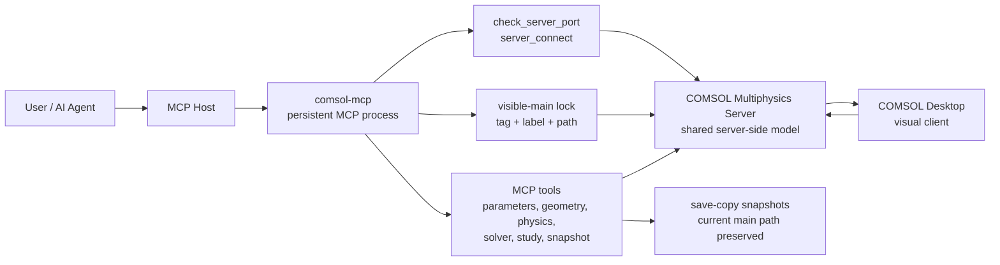

# COMSOL MCP

中文 | [English](#english)

`comsol-mcp` 是一个面向 COMSOL Multiphysics 的 MCP Server。它采用
**attach-first** 工作流：先连接到一个已经运行的 COMSOL Multiphysics Server，
再加载并锁定一个主 `.mph` 模型，让 MCP 和 COMSOL Desktop 看到并操作同一个
服务端模型。

这个项目的目标不是把 COMSOL 当成黑盒批处理器，而是让自动化过程保持可见：
你可以在 Desktop 中实时观察 MCP 对几何、参数、网格、求解和保存流程的修改。

## 当前实现状态（2026-09-23，G3.4 W18 验收完成）

> 本节反映 G3.4（Gate A: R01–R05 缺陷定向修补与 W18: 真实绘图、导出与 MCP ImageContent 回传）的实机 live 验收状态。
> 权威验收判定为 **PASS**，状态标识为 `W18_API_VISUAL_VERIFIED_SCOPED`，严格停止于 W18，未进入 W19–W26。

- **MCP 工具与接口面**：
  - `full` profile 静态发布 **67 个工具**（包含新增的 `plot.render` 与 `plot_render` 图像工具）。
  - 支持完整的 MCP `ImageContent(type="image", data=b64, mimeType="image/png")` 多模态图形返回与 TextContent 防膨胀摘要分离。
- **Gate A (R01–R05) 关键缺陷修复**：
  - **R01**: `project_root` 与 wheel 安装目录彻底解耦，拒绝将 `site-packages` 当作项目根。
  - **R02**: `artifact.read` 默认强制限制为注册产物（`require_registered=True`），拦截项目内私有 control prefs、token、`.env`、SQLite 数据库及安装源码。
  - **R03**: CSV 序列化保留 `[expression, outer, inner, point]` 真实四轴物理标签、空间坐标与单位，复数分离为 `real`/`imag`，提供 `csv_to_field_array` 1:1 双向重构。
  - **R04**: storage=artifact 响应剥离全量 `values`/`data`，提供有界 preview 与完整元数据；分块读取引入 `(inode, mtime, size)` 哈希缓存。
  - **R05**: 排除本地未公开历史分支依赖，全量拟发布 Git 对象通过零敏感信息安全审计。
- **W18 真实图形、导出与 MCP 图像回传能力**：
  - 原生支持 `plot.list`, `plot.group_create`, `plot.feature_create`, `plot.update`, `plot.remove`, `plot.view_manage` 以及 `export.*` 动作。
  - 属性设置与科学数据绑定全面 fail-closed（消除任何 `except: pass`）。
  - 真实 COMSOL 渲染：3D 表面图、1D 曲线图、2D CutPlane 截面图、几何渲染、网格渲染、瞬态多步对比渲染。
  - 完整图像 provenance（包含模型/解/时间/参数/表达式/单位/特征元数据）。
  - 模型存盘与重开（`saved_w18_model.mph` 由新独立 Worker 打开回读，无需重算直接重绘）。
  - 外部已有 mphserver 保护（PID 16067, 16138 存活且未受任何干扰）。
- **实机验收与交付状态**：
  - 实机 live 验收套件（`tests/run_g3_4_w18_acceptance.py`，A01–A07 与 V01–V11 共 18 项用例）**18/18 全部 PASS**（用时 75.00s，exit 0）。
  - 单元测试（pytest）全量 **1846 passed, 1 skipped** 全部通过。
  - 独立离线交付包（`COMSOL_MCP_G3_4_W18_DELIVERABLE.tar.gz`）包含全量独立 Git Bundle（`comsol_mcp_g3_4_w18.bundle`，支持 standalone clone），未执行外部 `git push`。
  - Windows/Linux/Intel Mac/COMSOL 6.3/GUI 及云端 Hermes 视觉接收继续保持 UNVERIFIED（云端界定为 `HOST_DELIVERY_UNVERIFIED`）。

## 主要特性

- 连接已有的 COMSOL Multiphysics Server
- 与 COMSOL Desktop 共享同一个服务端模型状态
- 支持 visible-main 主模型锁，避免误切换或误保存模型
- 支持参数设置、表达式求值、几何特征创建/更新/删除、物理场、变量、求解器配置和研究运行
- 支持主模型快照、当前模型保存、异步加载大型 `.mph`
- 公开工具接口稳定；历史基线为 50 个 MCP tools，**当前 full profile 发布 67 个工具 + 96 个领域 operation**
  （见上文“当前实现状态”）

## 最近功能更新

当前版本从 35 个 MCP tools 扩展到 50 个，重点补齐了真实 COMSOL 建模中经常需要绕回 Java 脚本的部分：

- 新增 9 个物理场与变量工具：列出/创建/删除 physics interface，管理 physics feature，设置选择集，管理变量节点。
- 新增 6 个求解器与异步工具：列出和创建 solver config，查看和配置 solver feature，后台运行 study 并轮询状态。
- 增强连接稳定性：为 COMSOL Java I/O 调用加入硬超时保护，避免连接、断开或加载模型时长期卡住 MCP runtime lock。
- 增强 `evaluate_expressions()`：支持更适合 2D/3D 模型的维度感知聚合、实体选择、时间点选择和结果大小限制。
- 修复状态报告：连接状态现在从共享 runtime state 动态读取，避免 `server_info()` 等工具显示过期的 disconnected 状态。
- visible-main 工作流继续保持锁定模型身份，新增工具也纳入 SAFE_READ / SAFE_WRITE 分类。

## 未来聚焦

下一阶段会优先让 COMSOL 日常仿真工作流更少依赖临时 Java 脚本：

- P0：材料管理、网格特征配置、结果后处理与图片/数据导出。
- P1：多物理耦合、探针管理、插值/解析/分段函数定义。
- P2：CAD/几何高级操作、工作平面、参数化扫描和自适应网格等高级求解器配置。
- 测试增强：为 physics、solver、connection timeout 增加更多 mock 单元测试，并保留 live COMSOL Server 集成测试入口。

长期目标是逐步扩展到约 75 个 MCP tools，覆盖 COMSOL 日常仿真的大部分建模、求解和结果提取操作。

## 适用场景

- 需要一边自动化建模，一边在 COMSOL Desktop 中检查模型变化
- 需要让 AI Agent 修改同一个当前主模型，而不是反复启动批处理任务
- 需要保留每次迭代的 `.mph` 快照
- 需要在长时间运行的 COMSOL Server 会话中做参数、几何或求解探索

## 环境要求

- Windows
- Python 3.10 或更高版本
- 本机已安装 COMSOL Multiphysics
- 有效的 COMSOL 许可证
- 手动启动的 `COMSOL Multiphysics Server`

## 安装

```powershell
git clone https://github.com/Ching-Chiang/comsol-mcp.git comsol-mcp
cd comsol-mcp
python -m pip install -e .
```

开发环境可安装测试依赖：

```powershell
python -m pip install -e ".[dev]"
```

## 环境变量

根据你的 COMSOL 安装位置设置：

```powershell
$env:COMSOL_ROOT = "C:\Program Files\COMSOL\COMSOL63\Multiphysics"
$env:COMSOL_SERVER_MCP_HOME = "$PWD\comsol-server-home"
```

`COMSOL_SERVER_MCP_HOME` 用于保存运行状态、日志、输出和快照。该目录默认位于
仓库下的 `comsol-server-home/`，并已被 `.gitignore` 忽略。

## 启动 MCP Server

推荐直接启动长驻 MCP 进程：

```powershell
python -m comsol_mcp.mcp_server
```

也可以使用脚本：

```powershell
.\scripts\start_comsol_mcp.ps1 -Python python -ComsolRoot "C:\Program Files\COMSOL\COMSOL63\Multiphysics" -McpHome "$PWD\comsol-server-home"
```

## MCP 配置示例

Claude Desktop 或其他 MCP host 可以参考：

- `examples/claude_desktop_config.json`
- `.mcp.json`

一个最小配置类似：

```json
{
  "mcpServers": {
    "comsol-mcp-server": {
      "command": "python",
      "args": ["-m", "comsol_mcp.mcp_server"]
    }
  }
}
```

## 推荐工作流



1. 手动启动 `COMSOL Multiphysics Server`。
2. 记录 Server 控制台显示的真实端口。
3. 启动本项目的 MCP Server，并保持进程运行。
4. 调用 `start_visible_main_workflow(host, port, path)`。
5. MCP 连接 Server、加载主 `.mph`，并锁定该 visible-main 模型。
6. 在 COMSOL Desktop 中连接同一个 Server。
7. 在 Desktop 中导入或切换到已经加载的服务端模型。
8. 后续通过 MCP tools 修改模型，并在 Desktop 中观察变化。

大型 `.mph` 如果加载时间超过 MCP host 的单次工具调用超时，使用异步入口。
请把示例路径替换为你本机可访问的 `.mph` 文件：

```text
start_visible_main_workflow_async("localhost", <actual_port>, "C:/path/to/model.mph")
visible_main_workflow_status("<job_id>")
```

## 单主模型配置

如果希望始终围绕一个当前主模型工作，并为每次迭代保存快照：

```text
configure_single_main_workflow(
  "C:/path/to/model.mph",
  "comsol-server-home/snapshots",
  "free_convection"
)
```

常用迭代流程：

```text
verify_visible_main_session()
run_visible_main_iteration("trial_label", "[{\"name\":\"param1\",\"expression\":\"1.0\"}]", "")
save_model()
```

## 工具列表

连接与状态：

- `server_info()`
- `check_server_port(host="localhost", port=2036)`
- `server_start(...)`
- `server_connect(host, port, model_name="")`
- `server_disconnect(shutdown_server=false)`
- `workflow_info()`
- `mcp_tool_audit()`

visible-main 工作流：

- `configure_single_main_workflow(current_main_model_path, snapshot_dir="", snapshot_prefix="", notes="")`
- `start_visible_main_workflow(host="localhost", port=2036, path="")`
- `start_visible_main_workflow_async(host="localhost", port=2036, path="")`
- `visible_main_workflow_status(job_id="")`
- `load_visible_main_model(path="")`
- `verify_visible_main_session()`
- `unlock_visible_main(reason)`
- `load_current_main_model()`

模型与保存：

- `model_create(name="Server Model")`
- `model_load(path)`
- `prune_loaded_models(keep="current")`
- `save_main_model_snapshot(snapshot_label)`
- `commit_current_main_model(snapshot_label="")`
- `save_model(path="")`
- `model_tree()`

参数、表达式与指标：

- `get_parameters()`
- `set_parameters(parameters_json)`
- `evaluate_expressions(expressions_json="[]")`
- `get_core_metrics()`

几何、网格与求解：

- `ensure_component(component="comp1", dimension=2)`
- `ensure_geometry(component="comp1", geometry="geom1", dimension=2)`
- `ensure_mesh(component="comp1", mesh="mesh1")`
- `create_feature(component, geometry, tag, feature_type, properties_json="[]", run_geometry=false)`
- `update_feature(component, geometry, tag, properties_json, run_geometry=false)`
- `delete_feature(component, geometry, tag, run_geometry=false)`
- `run_feature(collection, tag, component="comp1")`
- `run_study(study_tag="")`
- `run_visible_main_iteration(label, parameters_json="[]", study_tag="")`

物理场与变量：

- `list_physics(component="comp1")`
- `create_physics(component, tag, physics_type, dimension=0, dependent_variables="u")`
- `remove_physics(component, tag)`
- `list_physics_features(component, physics_tag)`
- `create_physics_feature(component, physics_tag, feature_tag, feature_type, properties_json="[]")`
- `update_physics_feature(component, physics_tag, feature_tag, properties_json)`
- `remove_physics_feature(component, physics_tag, feature_tag)`
- `set_physics_selection(component, physics_tag, feature_tag, entities_json)`
- `manage_variables(component="comp1", action="list", tag="", expressions_json="[]")`

求解器与异步运行：

- `list_solver_config()`
- `create_solver_config(sol_tag, study_tag)`
- `list_solver_features(sol_tag)`
- `configure_solver(sol_tag, feature_tag, properties_json="[]")`
- `run_study_async(study_tag="")`
- `run_study_status(job_id="")`

## visible-main 锁机制

`load_visible_main_model()` 成功后，MCP 会记录模型的 tag、label 和 path。
后续写操作会先检查当前服务端模型是否仍然是这个主模型。

- 安全读工具始终允许执行
- 安全写工具仅在模型身份匹配时允许执行
- `model_create()`、`model_load()`、`prune_loaded_models()`、
  `commit_current_main_model()` 在锁定状态下会被阻止

这个设计用于防止 Desktop 正在查看的主模型被意外切走或覆盖。

## 测试

普通测试不需要 COMSOL Server：

```powershell
pytest
```

带真实 COMSOL Server 的集成测试使用 `comsol_server` 标记，默认跳过。

## 项目结构

```text
comsol_mcp/
  _server.py            # FastMCP 实例、全局状态、工具分类
  _state.py             # 状态持久化、日志、路径和端口工具
  _connection.py        # 连接生命周期与客户端访问
  _model.py             # 模型采用、清理、visible-main 锁
  _model_ops.py         # 参数、表达式、指标、树和几何纯辅助函数
  _physics_ops.py       # 物理场与变量纯辅助函数
  _solver_ops.py        # 求解器配置纯辅助函数
  _tools_connection.py  # 连接相关 MCP tools
  _tools_workflow.py    # 工作流和 visible-main tools
  _tools_model.py       # 模型创建、加载、清理 tools
  _tools_params.py      # 参数、表达式、指标 tools
  _tools_geometry.py    # 组件、几何、网格、特征 tools
  _tools_physics.py     # 物理场、physics feature、变量 tools
  _tools_solver.py      # 求解器配置和异步 study tools
  _tools_snapshot.py    # 迭代、快照和保存 tools
  mcp_server.py         # 入口与工具注册
```

## 注意事项

- 本项目不包含 COMSOL 二进制文件或专有模型资源。
- COMSOL Desktop 连接 Server 后，可能需要手动导入或切换到服务端已加载模型。
- `server_start()` 只是高级备用入口；推荐手动启动 COMSOL Server 并使用真实端口连接。
- 保持 MCP 进程长驻，不要用一次性脚本加载模型后立刻退出。

## 联系方式

维护者：蒋铖 <jiang-jc24@mails.tsinghua.edu.cn>

## License

MIT. See `LICENSE`.

---

## English

`comsol-mcp` is an MCP server for COMSOL Multiphysics. It uses an
**attach-first** workflow: connect to an already running COMSOL Multiphysics
Server, load and lock a main `.mph` model, and let MCP tools and COMSOL
Desktop operate on the same server-side model.

The goal is visible automation. Instead of treating COMSOL as a black-box
batch runner, this server lets you watch geometry, parameters, mesh, solve
steps, and saved snapshots evolve in COMSOL Desktop.

### Current implementation status (2026-09-23, G3.4 W18 completed)

> This section reflects the completed verification status of G3.4 (Gate A fixes R01–R05 + W18 real plotting, rendering, and MCP ImageContent return).
> Authoritative acceptance verdict is **PASS** (`W18_API_VISUAL_VERIFIED_SCOPED`), stopped strictly at W18 without advancing to W19–W26.

- **MCP tool surface:** the `full` profile currently publishes **67 tools**
  (51 legacy + 7 execution/control + 7 registry/fallback + 2 W18 plotting tools: `plot.render`, `plot_render`); `domain`/`expert`
  narrow the static publication only. Legacy names and arguments stay compatible.
- **Domain-operation surface:** G3 adds **96 operations** called through
  `operation_call` / `registry_call` (alias) / `operation_describe`.
- **Docs:** `CLAUDE.md`, `AGENTS.md`, `PROGRESS.md`, `evidence/phase4_4_acceptance.json`.
- **Acceptance driver:** `python tests/run_g3_4_w18_acceptance.py` (live COMSOL 6.4 multi-case suite, A01–A07 + V01–V11 all 18 cases PASS).
- **Unit test suite:** full repository pytest suite **1846 passed, 1 skipped**.
- **Platform & environment:** verified on macOS Apple Silicon (Darwin aarch64), Commercial COMSOL Multiphysics 6.4 (Build 293), Java 11 (Amazon Corretto 11.0.28).
  Windows, Intel Mac, COMSOL 6.3 remain UNVERIFIED. Cloud Hermes delivery remains `HOST_DELIVERY_UNVERIFIED` until verified with live cloud vision model.

### Features

- Attach to an existing COMSOL Multiphysics Server
- Share one server-side model with COMSOL Desktop
- Lock the visible main model to prevent accidental model switching
- Set parameters, evaluate expressions, edit geometry and physics features, configure solvers, run mesh and studies
- Save main-model snapshots and handle large `.mph` loads asynchronously
- Stable MCP tool surface; the historical baseline was 50 tools — the current
  `full` profile publishes **67 tools + 96 domain operations** (see "Current
  implementation status" above)

### Recent Updates

The current version expands the tool surface from 35 to 50 MCP tools and removes several places where users previously had to fall back to ad hoc Java scripts:

- Added 9 physics and variable tools for physics interfaces, physics features, selections, and variable nodes.
- Added 6 solver and async tools for solver configs, solver features, background study execution, and polling.
- Added hard timeout protection around slow COMSOL Java I/O calls so connect, disconnect, and model load operations do not permanently block the MCP runtime lock.
- Enhanced `evaluate_expressions()` with dimension-aware aggregation, entity selection, time-point selection, and result-size limits.
- Fixed runtime status reporting so connection state is read from shared state rather than stale imported values.

### Future Focus

The next releases will focus on reducing the remaining need for handwritten COMSOL Java scripts:

- P0: material management, mesh feature configuration, result plots, image export, and data export.
- P1: multiphysics couplings, probes, and interpolation/analytic/piecewise functions.
- P2: CAD import, advanced geometry workflows, work planes, parametric sweeps, and adaptive mesh configuration.
- Testing: broader unit tests for physics, solver, and timeout behavior, plus live COMSOL Server integration scenarios.

The long-term target is about 75 MCP tools covering most day-to-day COMSOL modeling, solving, and result extraction workflows.

### Requirements

- Windows
- Python 3.10+
- Local COMSOL Multiphysics installation
- Valid COMSOL license
- A manually started `COMSOL Multiphysics Server`

### Install

```powershell
git clone https://github.com/Ching-Chiang/comsol-mcp.git comsol-mcp
cd comsol-mcp
python -m pip install -e .
```

For development:

```powershell
python -m pip install -e ".[dev]"
```

### Configuration

Set environment variables for your COMSOL installation:

```powershell
$env:COMSOL_ROOT = "C:\Program Files\COMSOL\COMSOL63\Multiphysics"
$env:COMSOL_SERVER_MCP_HOME = "$PWD\comsol-server-home"
```

Start the MCP server:

```powershell
python -m comsol_mcp.mcp_server
```

Example MCP host configuration:

```json
{
  "mcpServers": {
    "comsol-mcp-server": {
      "command": "python",
      "args": ["-m", "comsol_mcp.mcp_server"]
    }
  }
}
```

### Recommended Workflow

1. Start `COMSOL Multiphysics Server` manually.
2. Note the real listening port from the server console.
3. Keep `python -m comsol_mcp.mcp_server` running.
4. Call `start_visible_main_workflow(host, port, path)`.
5. Connect COMSOL Desktop to the same server.
6. Import or switch to the already loaded server-side model in Desktop.
7. Use MCP tools to modify the locked main model and watch Desktop update.

For large `.mph` files, use the async entrypoint and replace the example path
with a local `.mph` file:

```text
start_visible_main_workflow_async("localhost", <actual_port>, "C:/path/to/model.mph")
visible_main_workflow_status("<job_id>")
```

### Tests

```powershell
pytest
```

The default test suite does not require COMSOL. Integration tests that need a
live COMSOL Server are marked with `comsol_server` and skipped by default.

### Contact

Maintainer: mr jiang <jiang-jc24@mails.tsinghua.edu.cn>

### License

MIT. See `LICENSE`.
